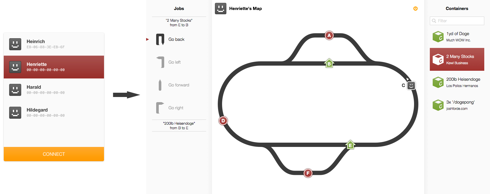

The hafenUI project
===================

Simulation of a Container terminal.

## Installation ##

- Get the source code from here
- Install [Node.js](http://www.nodejs.org)
- For debugging install nodemon via `npm install -g nodemon` (not neccessary)
- Set up a MySQL server. Could be [XAMPP](http://www.apachefriends.org)
- Set up the MySQL server to use user "root" with password "root" (you should change this for productive envirorments later `server/core/connectivity/dbData.js`)
- Import database from `server/containerhafen.sql` and add some robots to `robots` with a correct binary Bluetooth-MAC. The `image` field refers to png-files (without suffix) in `imgs/robots`
- Add a `bluetooth`-folder to the root directory of this project with these empty files:
	- `send.txt`
	- `receive.txt`
- Start the MySQL server
- Start the Node.js server: Navigate to the `hafenUI` folder in your command line, then run `nodemon -w server -w pages index.js` (if you decided to use nodemon)
- Run the `bluetooth.jar` in the command line to enable bluetooth support.
- If you add or modify robots in the database, you have to restart the Node server

** That's it. Everything should be up and running now. **

## How it works ##

The Node.js program starts a HTTP webserver you can connect with on port 3700 with your webbrowser: `http://IP:3700`. When you connect to a robot in the browser Node will tell the running `bluetooth.jar` to establish the connection. This is because there is no Lejos bluetooth API for JavaScript. The Java program only is a transmitter here. It just tells the Node server what the robots sent and sends whatever the Node server tells it to send.

Communcation between JS server and Java Client currently works via the filesystem (the two `.txt` files in the `bluetooth` folder).

[Overview of project structure](diagrams/generalStructure.pdf)

## File structure ##

- `embed`: All local CSS and JS resources for visualization
	- `css`: CSS files
	- `js`: JS files
		- `modules`: The client visualization is split into multiple modules. Each performing a small task in the whole thing (like handling the list of robots in the login screen or handling the connect button in the login screen, etc.). Each module file contains a description of what it does.
		- `script.js`: Main JS starting point. No need to change anything here. Does not contain any features. Just kickstarts the modules.
	- `frameworks`: JS and CSS frameworks we use are stored here.
- `java`: Source code of the Java client.
- `pages`: HTML base structures of the pages. We use the swig templating engine here.
- `server`: Code of the Node.js server
	- `core`: Contains abstract core features. Nothing server specific (HTTP connction handling and such thing) lies here.
		- `connectivity`: Handles connection stuff. Database connection bluetooth connections to robots via the filesytem and the Java Client.
		- `protocols`: Contains our RCP and BFP protocol implementations. Robot Control Protocol (the way we communicate with a robot and send commands to it). Bluetooth File Protocol (the way we communicate with the Java client via the txt files).
		- `contol`: Managers for the actual robot controlling.
			- `job.js`: Abstract module for a job the robot could do. Concrete implementations are in `jobs` (like move from point A to point B). Every job consists of a number of simple tasks. When a job is created it calculates the tasks it has to do and even recalculates it if needed (something unexpected happened and the goal has to be archieved in some other way).
			- `task.js`: Abstract module for a task the robot could do. Concrete implementations are in `tasks` (like turn left).
			- `routeCalculator.js`: Implementation of an A* algorithm that works on our database structure. It is able to use the "turns" (last position, current position, next position)  we use to store the map graph instead of the typical "connections" (current position, next position).
			- `robotMovement.js`: Just sends a single move command the a given robot via an abstract API. Used by the `task.js`. This way tasks do not need to handle things like bluetooth connections and timing issues. They just say "move left" and it works... ;-)
	- `static`: Contains files for opening a static HTTP server that just sends requested files like images as an Apache webserver would do. Used by the client to request the images in the typical `folder/folder/file.jpg` way. Also does the swig HTML rendering.
	- `socket`: Handles sockets (bidirectional connection between client and server). Things it does are establishing connections, handling disconnects, handling user requests and redirect them to the right `core` script. Sending `core` answers back to client.
- `imgs`: Images...
- `diagrams`: Contains useful graphics and diagrams that may help to understand what's going on.
